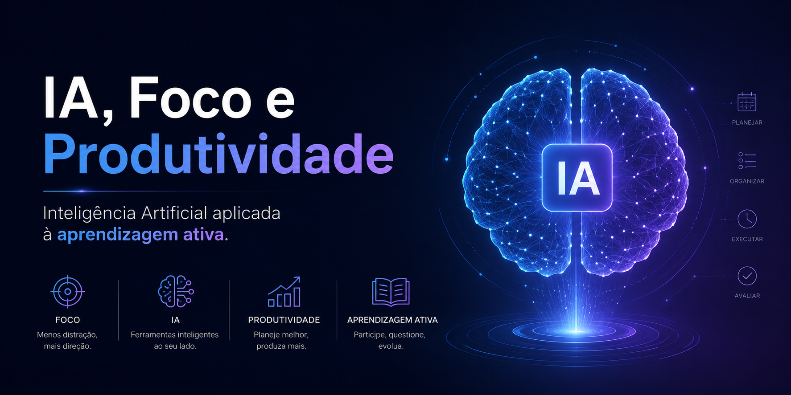

<p align="center">
  
</p>

---

# IA, Foco e Produtividade


Projeto desenvolvido para o desafio da DIO com o objetivo de explorar como a Inteligência Artificial pode auxiliar no combate à procrastinação, melhoria do foco e organização dos estudos através da aprendizagem ativa utilizando o NotebookLM.

O projeto busca unir neurociência, produtividade e IA para criar um material prático, organizado e reutilizável, demonstrando como ferramentas inteligentes podem apoiar estudantes e profissionais no desenvolvimento de melhores hábitos de aprendizagem.

---

## 🎯 Objetivos do Projeto

- Entender os principais gatilhos da procrastinação
- Aprender técnicas para melhorar foco e concentração
- Explorar como IAs podem auxiliar na organização dos estudos
- Desenvolver prompts reutilizáveis para produtividade
- Criar um miniguia prático de aprendizagem ativa
- Documentar o processo de utilização do NotebookLM

---

## 📚 Índice

- [🎯 Objetivos do Projeto](#-objetivos-do-projeto)
- [🛠️ Ferramentas Utilizadas](#️-ferramentas-utilizadas)
- [📖 Curadoria de Fontes](#-curadoria-de-fontes)
- [🧠 Engenharia de Prompts](#-engenharia-de-prompts)
- [📘 Miniguia de Estudos](#-miniguia-de-estudos)
- [📚 Glossário](#-glossário)
- [🚀 Aprendizados](#-aprendizados)

---

## 🛠️ Ferramentas Utilizadas

- NotebookLM
- ChatGPT
- GitHub
- Markdown

---

## 📖 Curadoria de Fontes

As fontes utilizadas no projeto estão disponíveis na pasta:

```txt
/fontes
```

---

## 🧠 Engenharia de Prompts

Durante o projeto, diferentes técnicas de engenharia de prompts foram testadas no NotebookLM com o objetivo de analisar como pequenas mudanças na construção das perguntas impactam diretamente a qualidade das respostas geradas pela IA.

As análises incluíram:
- profundidade das respostas;
- organização do raciocínio;
- clareza das explicações;
- contextualização;
- aplicabilidade prática;
- comportamento da IA diante de diferentes estruturas de prompt.

### Técnicas exploradas

| Técnica | Arquivo |
|---|---|
| Prompt Simples | `prompts/prompt-simples.md` |
| Zero-Shot Prompting | `prompts/zero-shot-prompting.md` |
| Few-Shot Prompting | `prompts/few-shot-prompting.md` |
| Chain of Thought Prompting | `prompts/chain-of-thought.md` |
| Comparação Entre Técnicas | `prompts/comparacao-dos-prompts.md` |

---

## 📸 Processo no NotebookLM

Durante os testes, foi utilizada principalmente a aba de conversa do NotebookLM para análise das respostas geradas pela IA e experimentação das diferentes técnicas de prompting.

### Recursos explorados

- Conversas contextualizadas
- Engenharia de prompts
- Comparação entre respostas
- Aprendizagem ativa
- Organização de conhecimento

### Próximos passos

Como continuidade futura do projeto, existe a intenção de explorar os recursos disponíveis na aba **Estúdio** do NotebookLM, incluindo:
- mapas mentais;
- apresentações;
- guias de estudo;
- resumos em áudio;
- materiais visuais automatizados.

Os testes, refinamentos e análises de prompts utilizados durante o projeto estão documentados em:

```txt
/prompts
```

---

## 📘 Miniguia de Estudos

O miniguia final contendo conceitos, técnicas e aplicações práticas está disponível em:

```txt
/miniguia
```

---

## 📚 Glossário

Os principais conceitos abordados no projeto foram organizados em um glossário para facilitar revisões futuras.

---

## 🚀 Aprendizados

Durante o desenvolvimento deste projeto foi possível compreender como a Inteligência Artificial pode atuar como ferramenta de apoio ao aprendizado, produtividade e organização dos estudos.

Além do estudo sobre procrastinação e foco, o projeto também contribuiu para o desenvolvimento de habilidades relacionadas à:
- engenharia de prompts;
- pensamento crítico;
- curadoria de conteúdo;
- organização de projetos no GitHub;
- documentação técnica;
- aprendizagem ativa.
